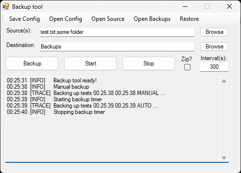

# Timed Backup Tool for Windows
### Utility for performing backups on a timed interval

<!--  -->

## Features
- Allows backup of **one or more files** and/or folders simultaneously
- Can do Manual backups or Start/Stop a timer for Automatic backups at a configurable interval
- Supports compressing into **ZIP** files
- Current configuration can be saved to a file to be loaded on startup
- Fast links to configuration, backups and source folders
- Can **restore** from a selected backup
- Can be hidden to the taskbar tray (configurable)
- Open-code so you can adapt it (remove/add/change features) with little knowledge of powershell

### Usecases
- I use it for making backups of my videogame 👾 save files (to be run as I play), for safety from save corruption or restoring saves in games without saves loading
- There are many more professional and advanced backup tools, but this one can still be used for any non-sensible files or data (documents, db files or similar)
- Fast and simple staff, the poweshell script is very fast to configure and versatile for file(s)/folder(s), with little menus and direct buttons to the folders
- For learning or adapting to your need, this is the first PS script I do (took me 12h or so) and the earlier versions are very simple (only 20 lines of code, as you can see in the first commits), you can go make one yourself or try to improve this one

## How to use (multiple options)
- Go to releases and download the exe file
- Download and run the powershell script (right click -> Run with PowerShell)
- Download the powershell and the Backup Launcher.vbs file to hide the console

Feel free to download/fork the repository and modify/improve/test it to your needs! (under non-commercial license, of course 😋)

### Notes on usage
- Browse to select sources will only let you select either a folder or multiple files (because of Windows dialog limitations), but **you can manually enter multiple sources** (mixed files and folders) separated by semicolons in the sources box
- Paths can be either **absolute, relative or mixed** to the script location
- It is allowed to select sources from different folders, but the restore option only uses the path of the first source as destination, so in that case manual restoration is needed

### Future features
- Configurable functionality to keep only a certain number of backups and delete old ones
- Add a different icon to the executable and taskbar tray
- Add option to Save and Load configurations (with a specific name)
- Change backup extension of only one file to be 'file_name.ext YYYY_MM_DD HH.mm.ss TYPE' to 'file_name YYYY_MM_DD HH.mm.ss TYPE.ext'
- Use robocopy with the option for mirroring (/MIR), creating hard links between copies (need to verify deleting old backups does not affect new ones)
- Fix blurry text on Display Scaling is different than 100%

### Known issues
- None (yet):
    - Folders cannot be copied into files, backing up/restoring a folder - when the destination has a file with exactly the same name as the backup/restore - will fail (not perform the backup/restore)

### Contributions
Bug reports, improvements and feature requests are welcome!

### Compile powershell script into an executable
```
Install-Module -Name PS2EXE -Scope CurrentUser
Invoke-PS2EXE backup_menu.ps1 'Backup Tool.exe' -noConsole
```
